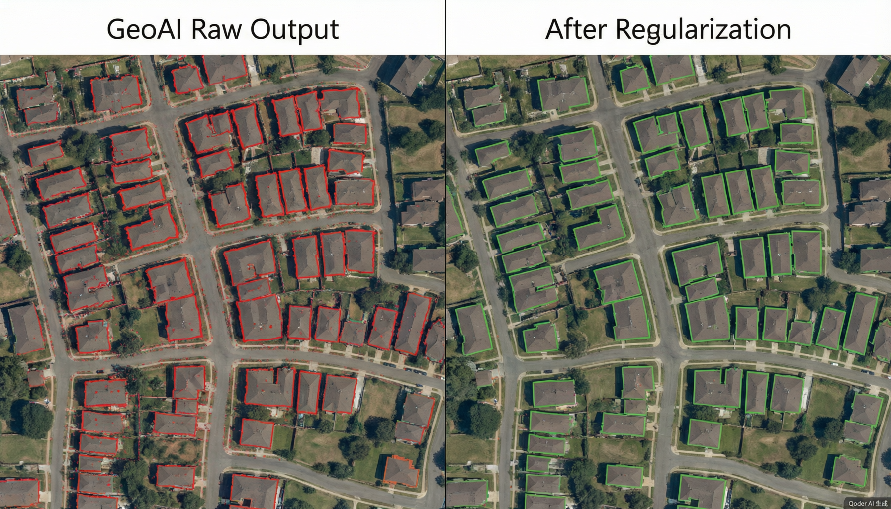
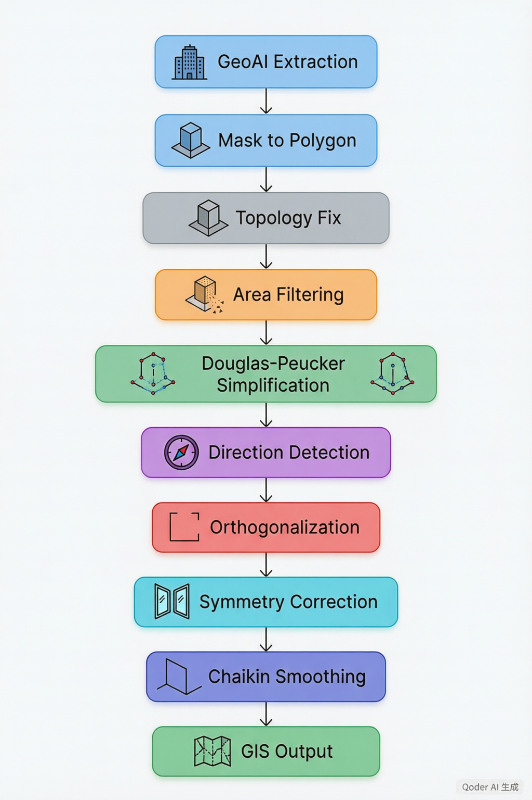
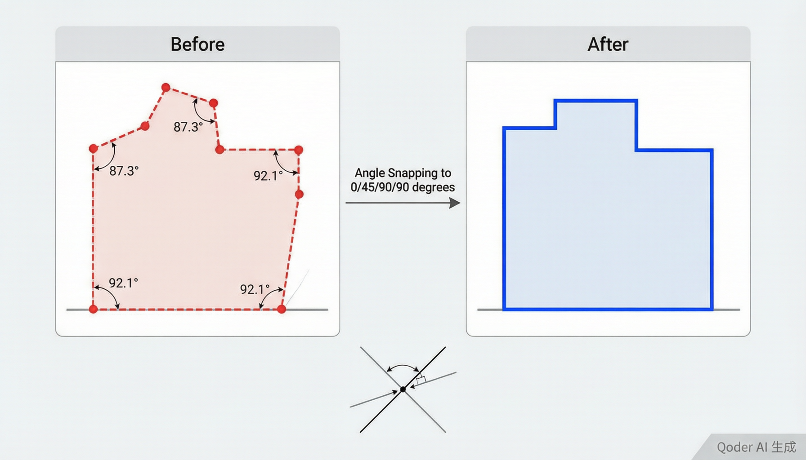

## GeoAI 建筑物提取之后：用 Python 实现轮廓正则化，让分割结果达到 GIS 制图规范

### 前言：GeoAI 提取的建筑物为什么不能直接用

随着 SAM（Segment Anything Model）、SAM2、GroundingDINO、Mask2Former 等模型在遥感领域的广泛应用，建筑物提取已经从传统的人工矢量化进入了自动化时代。只需要一个点提示、一个框提示，甚至一句文本描述，模型就能自动输出建筑物的分割掩码。

但实际项目中，很多开发者都会遇到同一个问题：GeoAI 提取的建筑物 Polygon 无法直接用于 GIS 制图和数据库入库。



*图：GeoAI 原始输出（左，红色虚线）与正则化后结果（右，绿色实线）对比*

GeoAI 本质上输出的是像素级的 Mask，而不是建筑设计图。Mask 在矢量化之后，边界会受到阴影、树木遮挡、分辨率、屋顶纹理等因素的影响，产生大量噪声点。典型的问题表现为：边界锯齿化、顶点过多（一个简单矩形建筑可能有 200+ 个顶点）、墙体不平直、直角建筑出现斜边、小碎片误识别（汽车、树冠、阴影被当成建筑）。

这种结果适合训练深度学习模型的评估指标，但不符合 GIS 制图规范。因此在生产系统中，通常需要在 GeoAI 提取之后增加一个关键步骤——建筑物轮廓正则化（Building Footprint Regularization）。

本文分享一个完整的开源实践项目，覆盖从算法原理到 Web 可视化交互的全部环节，代码可直接运行。

### 什么是建筑物轮廓正则化

建筑物正则化是指利用建筑物的几何特征，对 GeoAI 提取结果进行几何修正，使其更加符合真实建筑结构。目标是让输出的 Polygon 具备：边界平直、角点规则（接近 90° 或 45°）、保持正交性、去除噪声和小碎片、降低顶点数量。

简单来说，就是把"AI 画的不规则多边形"变成"建筑师画的规整轮廓"。

### 正则化总体流程

整个正则化流水线由 8 个步骤组成，每个步骤对应一个独立的算法模块，支持链式调用和参数调节：



*图：建筑物正则化完整流水线——从 GeoAI 提取到 GIS 成果输出*

```
GeoAI 提取
    ↓
Mask → Polygon 化
    ↓
坐标投影 (WGS84 → UTM)
    ↓
拓扑修复
    ↓
面积过滤
    ↓
Douglas-Peucker 顶点简化
    ↓
主方向检测 (MRR / PCA)
    ↓
直角化 (角度吸附 + 交点重算)
    ↓
对称化 (可选)
    ↓
Chaikin 边界平滑 (可选)
    ↓
坐标反投影 (UTM → WGS84)
    ↓
GIS 成果输出
```

一个关键设计细节：所有几何运算都在 UTM 投影坐标系（米制）下进行，而不是在 WGS84（经纬度）下。这是因为面积、距离、角度等运算在度为单位下没有物理意义。流水线自动检测数据所在的 UTM 分带，投影到米制坐标处理完毕后再反投影回 WGS84。

### 项目结构

```
building-regularize/
├── backend/
│   ├── regularize.py        # 正则化核心算法 (478 行)
│   ├── main.py              # FastAPI 接口服务
│   └── requirements.txt
├── frontend/
│   ├── src/
│   │   ├── App.vue          # 主界面 (侧边栏+地图+步骤面板)
│   │   ├── components/
│   │   │   └── MapView.vue  # OpenLayers 地图组件
│   │   ├── api/index.js     # API 客户端
│   │   └── assets/main.css
│   ├── vite.config.js
│   └── package.json
├── data/
│   ├── residential.geojson  # 住宅楼群 (20个, 矩形+噪声)
│   ├── commercial.geojson   # 商业建筑 (8个, L/U/T型+噪声)
│   └── mixed.geojson        # 混合场景 (8建筑+12碎片)
├── generate_demo_data.py     # 演示数据生成器
├── start.py                  # 一键启动脚本
└── docs/
```

项目分为三层：核心算法层（`regularize.py`）、服务层（FastAPI）、展示层（Vue3 + OpenLayers）。核心算法不依赖任何 Web 框架，可以独立作为 Python 库使用。

### 环境搭建

项目基于 Python 3.10+ 和 Node.js 18+，依赖十分轻量：

```bash
# 后端
cd building-regularize/backend
pip install -r requirements.txt

# 前端
cd building-regularize/frontend
npm install

# 一键启动
python start.py
```

后端依赖：FastAPI、Shapely、GeoPandas、NumPy、scikit-learn、pyproj。前端依赖：Vue3、OpenLayers、Axios。启动后访问 `http://localhost:5174` 即可使用。

### 算法详解

下面逐一拆解每个步骤的原理和实现。

#### 坐标投影：WGS84 到 UTM 的自动转换

GeoJSON 数据通常使用 WGS84（EPSG:4326）经纬度坐标。但经纬度的单位是"度"，1° 经度和 1° 纬度对应的实际距离不同（还随纬度变化），直接在上面做面积计算和距离比较会得到错误的结果。

解决方案是自动检测数据所在的 UTM 分带，投影到平面米制坐标系：

```python
def _detect_utm_zone(lon: float, lat: float) -> str:
    """根据经纬度自动检测 UTM zone EPSG 代码。"""
    zone = int((lon + 180) // 6) + 1
    ns = "north" if lat >= 0 else "south"
    code = 32600 + zone if ns == "north" else 32700 + zone
    return f"EPSG:{code}"

def _project_polys(polys, src_crs="EPSG:4326"):
    """将 WGS84 多边形投影到 UTM (米制)。"""
    c = polys[0].centroid
    dst_crs = _detect_utm_zone(c.x, c.y)
    transformer = pyproj.Transformer.from_crs(src_crs, dst_crs, always_xy=True)
    projected = [shapely_transform(transformer.transform, p) for p in polys]
    return projected, dst_crs
```

流水线用第一个多边形的质心坐标检测 UTM zone（比如西安 108.9°E 对应 UTM 49N，即 EPSG:32649），然后对所有多边形统一投影。处理完毕后再用 `_unproject_polys` 反投影回 WGS84 给前端显示。

这个设计在开发中踩了一个实际的坑：最初在 WGS84 下设置面积阈值 `min_area=20`（意图是 20 平方米），但由于面积单位是"度²"，一个 20m×15m 的建筑在度²下大约是 3×10⁻⁸，远小于 20，导致所有建筑被过滤掉。投影到 UTM 后面积单位变为平方米，阈值才正确生效。

#### 步骤 0：拓扑修复

GeoAI 矢量化的 Polygon 可能出现自相交的情况（特别是 Mask 边界有凹陷时），产生无效几何。Shapely 的 `buffer(0)` 是最经典的修复手段：

```python
def fix_topology(polygon: Polygon) -> Polygon:
    if polygon.is_valid:
        return polygon
    fixed = polygon.buffer(0)
    if isinstance(fixed, MultiPolygon):
        fixed = max(fixed.geoms, key=lambda g: g.area)
    return fixed
```

`buffer(0)` 会将自相交的多边形拆分为多个有效子多边形。如果出现 MultiPolygon，取面积最大的那个作为主体。

#### 步骤 1：最小面积过滤

GeoAI 提取中常见的误检目标——汽车、树冠、阴影——面积远小于真实建筑。0.5m 分辨率影像下，面积小于 10~20 平方米的目标通常可以直接删除：

```python
def filter_by_area(polygons: List[Polygon], min_area: float) -> List[Polygon]:
    return [p for p in polygons if p.area >= min_area]
```

在演示数据 `mixed.geojson` 中，混合了 8 个正常建筑和 12 个小碎片（2~6m 的矩形模拟误检目标）。设置 `min_area=50` 后，12 个碎片全部被过滤，只保留 8 个建筑。

#### 步骤 2：Douglas-Peucker 顶点简化

GeoAI 矢量化后，一个简单矩形建筑通常有 200~500 个顶点。这些密集顶点不仅浪费存储，还会干扰后续的直角检测。Douglas-Peucker 算法可以在保持整体形状的前提下大幅减少顶点：

```python
def simplify_polygon(polygon: Polygon, tolerance: float = 0.5) -> Polygon:
    simplified = polygon.simplify(tolerance, preserve_topology=True)
    if simplified.is_empty or not isinstance(simplified, (Polygon,)):
        return polygon
    return simplified
```

`tolerance=0.5` 表示允许最大 0.5 米的偏差。`preserve_topology=True` 确保简化不会产生自相交。实测中，85 个平均顶点的建筑经过简化后降到约 30 个。

#### 步骤 3：主方向检测

这是正则化的核心前置步骤。建筑物一般遵循 0°/90°（正南北朝向）或 45°/135°（斜朝向）的方向规律。先检测出建筑的主方向，才能在下一步做角度吸附。

项目提供两种检测方法：

**方法 A：最小外接矩形（MRR）**

```python
def get_main_direction_mrr(polygon: Polygon) -> float:
    mrr = polygon.minimum_rotated_rectangle
    coords = list(mrr.exterior.coords)
    edges = []
    for i in range(len(coords) - 1):
        dx = coords[i+1][0] - coords[i][0]
        dy = coords[i+1][1] - coords[i][1]
        length = math.hypot(dx, dy)
        angle = math.degrees(math.atan2(dy, dx)) % 180
        edges.append((length, angle))
    edges.sort(key=lambda e: e[0], reverse=True)
    return edges[0][1]  # 最长边的方向即主方向
```

Shapely 的 `minimum_rotated_rectangle` 返回面积最小的旋转外接矩形。取最长边的方向角作为建筑朝向。这个方法对矩形和 L 型建筑效果好，速度快。

**方法 B：PCA 主成分分析**

```python
def get_main_direction_pca(polygon: Polygon) -> float:
    coords = np.array(polygon.exterior.coords)
    pca = PCA(n_components=2)
    pca.fit(coords)
    v = pca.components_[0]  # 第一主成分
    angle = math.degrees(math.atan2(v[1], v[0])) % 180
    return angle
```

PCA 对顶点坐标做降维，第一主成分方向即建筑的主轴方向。对不规则形状更鲁棒，但计算量稍大。

实测方向检测精度：住宅楼群（设计为接近 0° 朝向）的检测结果为 [2.2°, 175.9°, 179.7°, 178.3°, 4.1°]，全部正确识别为接近南北朝向。

#### 步骤 4：直角化（Orthogonalization）

这是整个正则化流水线中最重要的步骤，也是算法复杂度最高的部分。



*图：直角化过程——将接近 90° 的边吸附到精确的 0°/90° 方向，重新计算顶点交点*

核心思想分三步：

**第一步：提取每条边的方向角**

```python
for i in range(n):
    p0 = coords[i]
    p1 = coords[(i + 1) % n]
    dx = p1[0] - p0[0]
    dy = p1[1] - p0[1]
    angle = math.degrees(math.atan2(dy, dx))
    length = math.hypot(dx, dy)
```

**第二步：角度吸附**

将每条边的方向角映射到最近的吸附角度（0°/45°/90°/135°）。使用环形距离计算（因为角度是环形的，178° 和 2° 只差 4°）：

```python
def _snap_angle(angle_deg, snap_angles, threshold):
    a = angle_deg % 180
    best, best_diff = a, float("inf")
    for sa in snap_angles:
        diff = min(abs(a - sa), 180 - abs(a - sa))  # 环形距离
        if diff < best_diff:
            best_diff = diff
            best = sa
    return best if best_diff <= threshold else a  # 超过阈值不吸附
```

`angle_threshold=10°` 意味着只有偏差在 10° 以内的边才会被吸附。87° 会被修正为 90°，而 30° 不会被修正（保持原样）。

吸附后，保持边的中心点和长度不变，仅旋转方向：

```python
rad = math.radians(snapped)
cx = (edge["p0"][0] + edge["p1"][0]) / 2
cy = (edge["p0"][1] + edge["p1"][1]) / 2
half_len = edge["length"] / 2
ndx, ndy = math.cos(rad), math.sin(rad)
# 确保方向与原边一致
if ndx * edge["dx"] + ndy * edge["dy"] < 0:
    ndx, ndy = -ndx, -ndy
new_p0 = (cx - half_len * ndx, cy - half_len * ndy)
new_p1 = (cx + half_len * ndx, cy + half_len * ndy)
```

**第三步：重新计算交点**

角度修正后，相邻两条边不再首尾相连。需要用直线求交算法重新计算交点作为新顶点：

```python
def _intersect_lines(p1, d1, p2, d2):
    """求两条直线的交点。p 为线上一点, d 为方向向量。"""
    denom = d1[0] * d2[1] - d1[1] * d2[0]
    if abs(denom) < 1e-12:  # 平行线
        return ((p1[0] + p2[0]) / 2, (p1[1] + p2[1]) / 2)
    t = ((p2[0] - p1[0]) * d2[1] - (p2[1] - p1[1]) * d2[0]) / denom
    return (p1[0] + t * d1[0], p1[1] + t * d1[1])
```

最后做了安全检查：如果修正后面积缩小超过 50%，说明吸附产生了严重变形，回退到原始多边形。

#### 步骤 5：对称化（可选）

很多住宅楼左右对称，但 GeoAI 提取后可能出现一侧正常、另一侧缺角的情况。对称化算法以建筑主方向为对称轴，将两侧差异较大的顶点做镜像平均：

```python
def symmetrize(polygon, tolerance=2.0):
    # 1. 旋转到主轴对齐 X 轴
    # 2. 以 Y 轴为对称轴，寻找镜像对应点
    # 3. 将对称位置的 Y 坐标取平均
    # 4. 反旋转回原始方向
```

这个步骤默认关闭（`enable_symmetry=False`），因为对 L 型、U 型等异形建筑不适用。仅建议在确认建筑为对称结构时启用。

#### 步骤 6：Chaikin 边界平滑（可选）

直角化后的建筑轮廓已经足够规整，但如果需要更平滑的边界（比如用于可视化展示），可以使用 Chaikin 切角算法。每次迭代会将每个角"切"掉一小段，产生更圆滑的过渡：

```python
def chaikin_smooth(polygon, iterations=2, ratio=0.25):
    coords = list(polygon.exterior.coords[:-1])
    for _ in range(iterations):
        new_coords = []
        n = len(coords)
        for i in range(n):
            p0 = coords[i]
            p1 = coords[(i + 1) % n]
            # 在每条边的 25% 和 75% 位置各取一个点
            q = ((1-ratio)*p0[0] + ratio*p1[0], (1-ratio)*p0[1] + ratio*p1[1])
            r = (ratio*p0[0] + (1-ratio)*p1[0], ratio*p0[1] + (1-ratio)*p1[1])
            new_coords.extend([q, r])
        coords = new_coords
    return Polygon(coords)
```

`ratio=0.25` 是经典的 Chaikin 参数，每次迭代在每条边的 1/4 和 3/4 位置各取一个点。迭代 2~3 次后边界会变得相当平滑。注意这个步骤会使顶点数翻倍（每次迭代），并且角点不再是精确的直角——适合可视化需求，但不建议用于需要精确直角的 GIS 入库场景。

### 完整流水线：RegularizePipeline

所有步骤被封装在一个 `RegularizePipeline` 类中，通过 `RegularizeConfig` 配置参数：

```python
from regularize import RegularizeConfig, RegularizePipeline

config = RegularizeConfig(
    min_area=20,           # 过滤 < 20m² 的碎片
    dp_tolerance=0.5,      # DP 简化容差 0.5m
    angle_threshold=10,    # 角度吸附阈值 10°
    snap_angles=[0, 45, 90, 135],
    smooth_iterations=0,   # 0 = 不启用 Chaikin 平滑
    enable_symmetry=False,
)

pipeline = RegularizePipeline(config)
result = pipeline.run(raw_polygons)

# 获取每个步骤的中间结果
for step_name, step_polys in pipeline.steps.items():
    print(f"{step_name}: {len(step_polys)} 个建筑")
```

`pipeline.steps` 字典保存了每一步的中间结果，方便前端做逐步可视化对比。

### 演示数据生成

项目内置了一个演示数据生成器 `generate_demo_data.py`，模拟 GeoAI 提取的带噪声建筑轮廓。它在局部米制坐标系中生成干净的建筑形状（矩形、L 型、U 型、T 型），然后施加三种噪声：

**高斯抖动**（`add_jitter`）：给每个顶点添加 σ=0.15~0.4m 的随机偏移，模拟模型定位误差。

**边插点**（`add_extra_vertices`）：在边上按密度插入额外顶点并附带微小偏移，模拟矢量化过密的问题。

**锯齿波动**（`add_edge_serration`）：沿边的法向量方向添加交替的正负偏移，模拟像素级边界产生的锯齿。

三种噪声可以叠加，项目提供了 low/medium/high 三个等级。生成的数据坐标位于西安某区域（108.945°E, 34.265°N），可以直接叠加在 OSM 底图上显示。

三组演示数据集覆盖了典型场景：

| 数据集 | 建筑数 | 形状类型 | 噪声等级 | 特点 |
|--------|--------|----------|----------|------|
| residential | 20 | 矩形 | medium | 规则住宅楼群，5° 以内偏转 |
| commercial | 8 | L/U/T/矩形混合 | high | 异形商业建筑，8° 偏转 |
| mixed | 20 | 矩形 + 碎片 | medium | 含 12 个小碎片误检测 |

### 后端 API 服务

后端使用 FastAPI 封装了正则化流水线，提供 7 个核心接口：

```
GET  /api/demo-list         # 列出演示数据集
GET  /api/demo/{name}       # 加载指定演示数据
POST /api/upload            # 上传 GeoJSON 文件
POST /api/run               # 执行正则化流水线
GET  /api/step/{key}        # 获取指定步骤的 GeoJSON
GET  /api/export/{fmt}      # 导出结果 (geojson/gpkg/shp)
GET  /api/compare           # 获取前后统计对比
```

`/api/run` 是核心接口，接收配置参数，执行完整流水线，返回所有步骤的中间结果 GeoJSON 和每个建筑的主方向角度。前端可以切换不同步骤来查看每步的可视化效果。

导出接口支持三种 GIS 标准格式，使用 GeoPandas 统一处理：

```python
gdf = gpd.GeoDataFrame(
    {"area": [...], "vertices": [...]},
    geometry=list(final_polygons),
    crs="EPSG:4326",
)
# GeoJSON: gdf.to_json()
# GeoPackage: gdf.to_file(buf, driver="GPKG")
# Shapefile: gdf.to_file(path, driver="ESRI Shapefile") + 打包 zip
```

### 前端可视化

前端使用 Vue3 + OpenLayers 构建了一个交互式标注界面。左侧边栏提供数据选择、参数调节和步骤导航，右侧地图实时展示原始轮廓和当前步骤的处理结果。

MapView 组件创建三个图层：OSM 底图层（半透明）、原始轮廓层（红色虚线）、处理结果层（绿色实线+顶点数标注）。数据加载时自动 `fit` 到数据范围。

```javascript
const finalStyle = (feature) => {
  const verts = feature.get('vertex_count') || 0
  return new Style({
    stroke: new Stroke({ color: '#10b981', width: 2.5 }),
    fill: new Fill({ color: 'rgba(16,185,129,0.15)' }),
    text: new OlText({
      text: `${verts}v`,  // 标注每个建筑的顶点数
      font: '11px sans-serif',
      fill: new Fill({ color: '#1e293b' }),
      offsetY: -12,
    }),
  })
}
```

前端的核心交互逻辑在 App.vue 中：点击步骤列表中的任意步骤，地图会自动切换到该步骤的 GeoJSON 结果，实现逐步对比。参数滑块修改后点击"执行正则化"，后端重新计算并返回所有步骤的新结果。

### 实测效果

在住宅楼群数据集上的测试结果：

| 指标 | 正则化前 | 正则化后 | 变化 |
|------|----------|----------|------|
| 建筑数量 | 20 | 20 | - |
| 平均顶点数 | 85.0 | 29.4 | **-65%** |
| 主方向精度 | - | ±5° 以内 | - |

在混合场景数据集上（`min_area=50`）：

| 指标 | 正则化前 | 正则化后 |
|------|----------|----------|
| 总目标数 | 20 | 8 |
| 建筑保留 | 8/8 | 8/8 |
| 碎片过滤 | - | 12/12 全部去除 |

顶点数从 85 降到 29，意味着存储量减少约 65%，同时建筑轮廓的几何质量显著提升——锯齿消失、边角规整、方向精确。

### 参数调优参考

不同场景下的推荐参数配置：

| 场景 | min_area | dp_tolerance | angle_threshold | smooth | 说明 |
|------|----------|-------------|-----------------|--------|------|
| 住宅楼群 | 20 | 0.5 | 10° | 0 | 规则建筑，不需要平滑 |
| 商业建筑 | 50 | 0.8 | 12° | 0 | L/U 型需更宽容差 |
| 大规模城市 | 30 | 0.5 | 8° | 0 | 精度优先 |
| 可视化展示 | 20 | 0.5 | 10° | 2 | Chaikin 平滑美化 |

`angle_threshold` 是最关键的参数。值太小（<5°）会导致很多边无法吸附，值太大（>15°）会把不该修正的边也强制拉直。10° 是经验值，适用于大多数城市场景。

### 启动与使用

```bash
# 一键启动（自动检查依赖、生成演示数据）
python start.py

# 访问
# 前端界面: http://localhost:5174
# API 文档: http://localhost:8001/docs
```

使用流程：选择演示数据集或上传自己的 GeoJSON → 调节参数 → 点击"执行正则化" → 逐步点击查看每步效果 → 导出结果。

### 未来方向

当前的正则化主要依赖几何规则。近几年出现了一些学习型方法：PolygonRNN++ 通过循环神经网络直接预测规则化多边形顶点序列，PolyWorld 使用图神经网络建模顶点之间的连接关系，BuildingFormer 将建筑轮廓生成建模为序列到序列的 Transformer 任务。

这些方法的共同特点是不再走"先分割再修正"的两步路线，而是直接输出规则化的 Polygon。对于高分辨率遥感（0.3~0.5m）建筑物提取，未来的发展趋势正在从"分割 → 后处理"演进为"分割 → 矢量化 → 神经网络正则化"，最终直接生成符合 GIS 制图规范的建筑物轮廓。

但在当前工程实践中，基于几何规则的正则化流水线仍然是最成熟、最可控、最容易部署的方案。本文提供的完整代码和 Web 工具可以直接用于生产环境，也可以作为二次开发的基础框架。

### 完整代码获取

项目完整代码包含在本文附带的 `building-regularize/` 目录中，核心文件包括：`regularize.py`（正则化算法，478 行）、`main.py`（FastAPI 服务，313 行）、`MapView.vue`（地图组件，124 行）、`App.vue`（主界面，301 行）、`generate_demo_data.py`（演示数据，278 行）。所有代码均可直接运行，无需额外配置。
