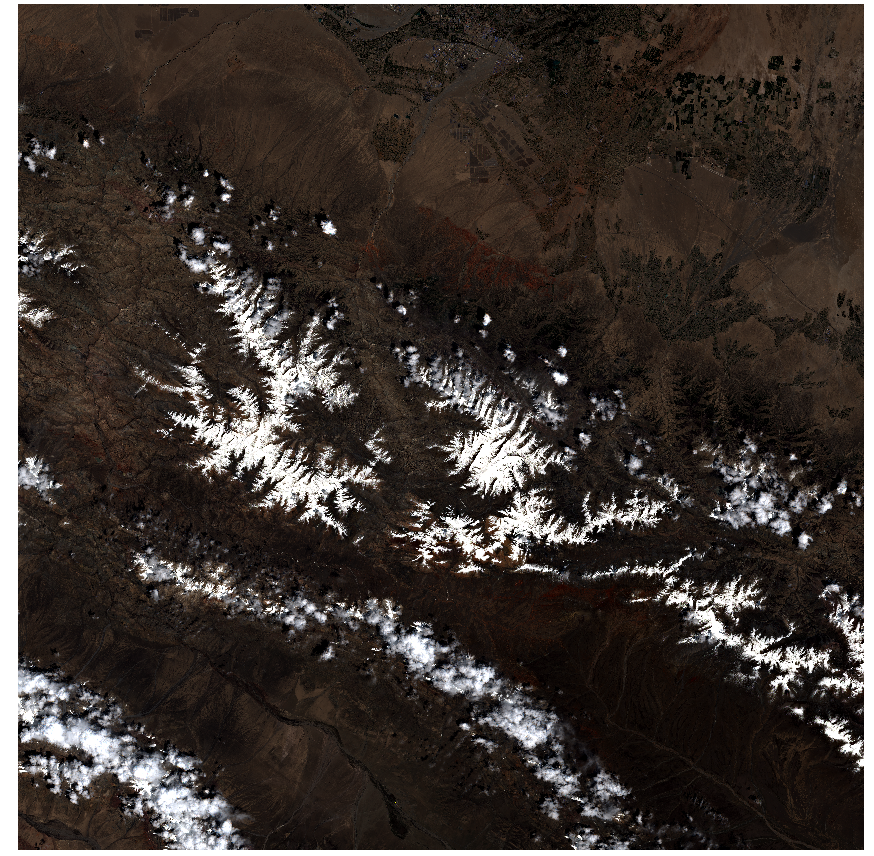

# 踩坑 ResNet 推理遥感影像

## 背景

最近也是暂时有点空，再将geoai捡起来，好好学习学，学习重点也是最近在写的模型微调，训练与推理，目标也比较明确，就是将最近文章中的模型再扎扎实实的过一遍，当然还是受设备的限制，没办法进行去迭代训练。只是做推理，尽可能见模型推理做成流程化的。

## ResNet 做遥感分类？

ResNet（Residual Network，残差网络）是经典卷积神经网络。它的核心设计是残差连接：网络不直接学习完整的目标映射，而是学习输入与输出之间的“变化量”。

在遥感场景中，ResNet 可以学习影像块中的纹理、颜色、形状和空间组合特征，例如森林的连续纹理、水体的光谱颜色、居民区的规则结构。需要注意的是，标准 ResNet 是**图像块分类模型**：输入一个影像块，输出一个类别；它并不是直接逐像素输出类别的语义分割模型。

注意：这里是影像块，说白了就是一个一张图片，按置信度 这张图整体最像哪个类别

## 本次踩坑记录

今天先把 Landsat 8 和 Sentinel-2 的处理目录理了一遍。Landsat 8 下载下来是单波段文件，计划按 B4、B3、B2 组合成 RGB，并使用 `QA_PIXEL` 去掉云、云影和无效值。Sentinel-2 下载下来是 `.SAFE.zip`，解压到 `resNet/sentinel2/00_extracted_safe` 后，里面是多个 `.SAFE` 目录。

Sentinel-2 脚本第一次运行时，提示找不到 B02。后来检查发现，脚本把 SAFE 目录里面的 `manifest.safe` 也当成了一个 SAFE 产品。这个文件只是描述文件，不是影像目录，所以自然找不到 B02。修改成只搜索 `.SAFE` 文件夹后，B02、B03、B04 和 SCL 都能正常找到。

没有直接跑完整研究区，先找了一块小范围测试。研究区比较大，10 米分辨率下如果直接把所有场景完整镶嵌，内存占用会很高。小范围测试完成了波段镶嵌、SCL 掩膜、RGB 合成、切片和推理，输出了 RGB 影像、分类格网和置信度格网。流程本身能跑，但当时没有遥感分类权重，所以使用的是 ImageNet 的 ResNet50，结果只能用来检查流程。

后面又发现 `resNet/data.tif` 已经是一个四波段 GeoTIFF，尺寸是 `10980 × 10980`。原来的图片推理代码用 Pillow 读取不了这个 TIFF，也不适合把接近 1 GB 的影像一次性读进内存。于是给推理脚本加了 GeoTIFF 输入：读取时选择第 3、2、1 波段作为 RGB，直接降采样到 `224 × 224`，再送入 ResNet。

单图测试生成了 `resNet/data_resnet_result.json`。最高结果是 `alp`，概率约 17%。这个结果没有遥感解释意义，但至少说明 GeoTIFF 读取、波段选择、模型加载和推理输出都已经通了。

模型缓存也统一放到项目的 `models/hub/checkpoints` 目录。缺少 ResNet50 权重时，脚本会自动从 torchvision 下载；有本地权重时直接复用。

## 输入数据：四波段 `data.tif`

本次测试影像位于：



```text
resNet/data.tif
```

其数据特征为：

| 属性 | 值 |
|---|---|
| 波段数 | 4 |
| 数据类型 | `uint16` |
| 尺寸 | 10980 × 10980 像素 |
| 坐标系 | EPSG:32647（UTM 47N） |
| 适用方式 | 选择其中 3 个波段组成 RGB 后输入标准 ResNet |

标准 ImageNet ResNet 第一层接收三个通道，因此不能将四个波段直接送入当前模型。常见 Sentinel-2 四波段文件通常按“蓝、绿、红、近红外”保存，此时可选择：

```text
R = 第 3 波段（红）
G = 第 2 波段（绿）
B = 第 1 波段（蓝）
```

即命令行参数 `--bands 3 2 1`。

> 提示：当前 `data.tif` 没有写入波段名称，因此 `3/2/1` 是基于常见顺序的假设。正式业务中应根据数据来源、波段说明或导出软件确认实际顺序，不能仅凭波段数量判断。

## GeoTIFF 推理时做了什么？

原始影像接近 1 GB。如果完整读取到内存再缩放，会产生不必要的内存压力。因此脚本使用 Rasterio 在读取时完成降采样：

```text
四波段 GeoTIFF（10980 × 10980）
  ↓ 选择第 3、2、1 波段
RGB 三通道影像
  ↓ 读取时双线性重采样
224 × 224 × 3
  ↓ DN × 0.0001，转换为近似反射率并限制到 [0, 1]
反射率 RGB
  ↓ ImageNet 均值/标准差标准化
ResNet-50 输入 Tensor
  ↓ Softmax
Top-K 类别与概率
```

ImageNet 标准化公式为：

```python
mean = [0.485, 0.456, 0.406]
std  = [0.229, 0.224, 0.225]
x_normalized = (x - mean) / std
```

对于 Sentinel-2 Level-2A，常见量化值是 10000，因此通常使用：

```text
reflectance = DN × 0.0001
```

如果产品元数据 `MTD_MSIL2A.xml` 中给出了 `BOA_ADD_OFFSET=-1000`，则应使用等价偏移：

```text
reflectance = DN × 0.0001 - 0.1
```

## 直接运行 GeoTIFF 单图测试

### Conda 环境

本项目使用的环境路径为：

```text
D:\Program\Conda\envs\python12
```

直接运行命令：

```powershell
& "D:\Program\Conda\envs\python12\python.exe" resNet\resnet_inference_example.py --geotiff resNet\data.tif --bands 3 2 1 --scale 0.0001 --device cpu --output resNet\data_resnet_result.json
```

也可以运行已准备好的 Windows 启动脚本：

```powershell
.\resNet\run_data_tif_test.bat
```

该脚本会激活 `python12` 环境、读取 `resNet/data.tif`，并将结果写入：

```text
resNet/data_resnet_result.json
```

### 参数说明

| 参数 | 示例 | 含义 |
|---|---|---|
| `--geotiff` | `resNet/data.tif` | 多波段 GeoTIFF 路径 |
| `--bands` | `3 2 1` | 用作 Red、Green、Blue 的波段序号，从 1 开始计数 |
| `--scale` | `0.0001` | DN 转反射率的缩放系数 |
| `--offset` | `-0.1` | 可选反射率偏移；普通产品保持默认 0 |
| `--device` | `cpu` 或 `cuda` | 推理设备 |
| `--checkpoint` | `xxx.pth` | 可选的自训练 ResNet 分类权重 |
| `--output` | `data_resnet_result.json` | JSON 结果保存位置 |

## 为什么结果只有一个 JSON？

当前 GeoTIFF 命令是**整图分类测试**：它把整幅 10980 × 10980 的影像缩放为一张 224 × 224 图片，因此 ResNet 只输出一次预测。

```text
一整幅影像 → 一张 224 × 224 输入图 → 一个 Top-K 预测结果
```

JSON 记录了输入影像、使用的波段、原始空间范围、类别编号、类别名称与概率。例如：

```json
{
  "geotiff": "resNet\\data.tif",
  "source_bands": [3, 2, 1],
  "source_shape": [10980, 10980],
  "topk": [
    {"class_id": 970, "class_name": "alp", "probability": 0.173938}
  ]
}
```

若当前加载的是 ImageNet 模型，`alp` 这样的结果只说明模型已正常工作，不应解读为遥感地物结论。

## 从整图测试到空间分类图

如果目标是得到地图，而不是整幅图只有一个类别，需要采用滑动窗口切片推理：

```text
大幅 GeoTIFF
  ↓ 按固定大小切片，例如 Sentinel-2 使用 192 × 192 像素
多个影像块
  ↓ 每块缩放到 224 × 224 并送入 ResNet
多个类别与置信度
  ↓ 根据切片位置回填到地理坐标
classification_grid.tif + confidence_grid.tif
```

项目中的 Sentinel-2 SAFE 流程已经实现了这种方式：

```text
resNet/sentinel2/sentinel2_pipeline.py
```

其主要输出为：

- `classification_grid.tif`：一个像元对应一个切片的预测类别。
- `confidence_grid.tif`：对应切片的最高类别概率。
- `tile_predictions.json`：每个格网的类别与置信度明细。

对于 10 米分辨率 Sentinel-2，`192 × 192` 像素约表示 `1.92 km × 1.92 km` 的地面范围；对于 30 米分辨率 Landsat，使用 `64 × 64` 像素可得到近似相同的地面覆盖范围。


## 结论

单独的使用 ResNet 个人感觉不合适，要把影像切成小区块，再使用geoai将小区块行列值与坐标联系起来意义不大，而且识别是判断这个区块内容的可能。没有太大意义，想到可利用的场景是，目标识别时，截取目标识别图块，让ResNet去识别，但是1000中物体，有些没有的还需要训练，所以将学习进度止步到这里，后面研究其他模型时，再结合ResNet深入研究。

完整的代码已经上传
