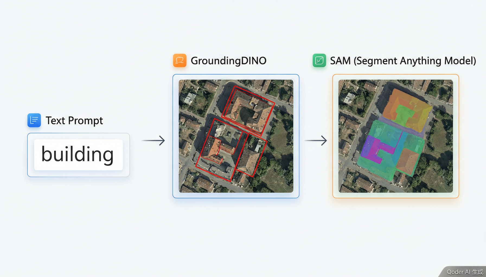
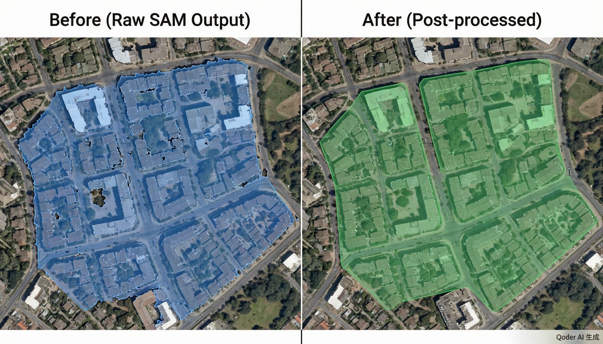
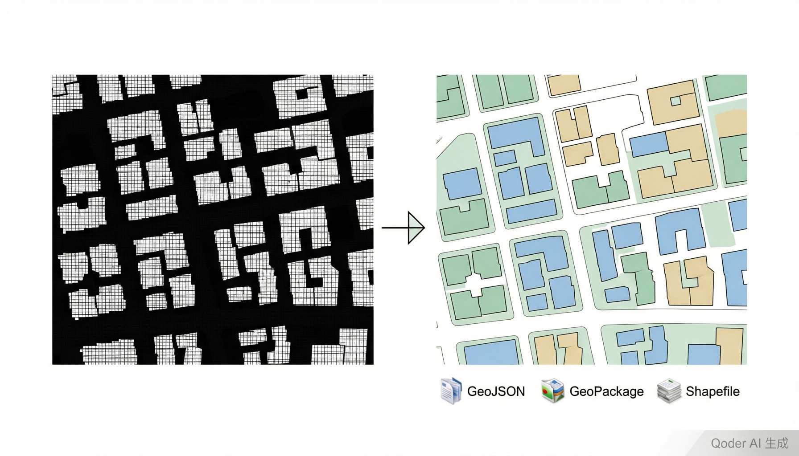

# GeoAI SAM Web 平台使用手册

本文面向实际操作人员，说明如何启动 Web 平台、加载影像、执行点标注、框标注、文本标注、后处理和矢量导出，并解释每一步结果是否正确。

> 截图说明：本轮尝试接入 Codex in-app Browser 时，浏览器插件因 Windows 用户目录权限问题初始化失败；本地也未发现可直接调用的 Playwright/Chrome 运行时。因此本文暂时插入项目已有结果图作为效果示例，未能自动采集新的浏览器界面截图。待浏览器工具恢复后，可补充真实操作截图到 `docs/images/` 并替换本文对应位置。

## 1. 启动前检查

### 1.1 检查影像路径

当前默认影像路径已经配置为：

```text
E:\data\baoji\宝鸡市\I48E006018\I48E006018.tif
```

启动前应确认该文件存在。如果文件不存在，Web 加载影像时会返回“文件不存在”。

### 1.2 检查模型文件

模型默认目录：

```text
models/
```

推荐优先使用 `vit_l`。如果显存不足，可以切换到 `vit_b`；如果追求更高精度并且显存充足，可以切换到 `vit_h`。

### 1.3 检查依赖

后端需要：

| 依赖 | 用途 |
| --- | --- |
| `fastapi` / `uvicorn` | Web API 服务 |
| `rasterio` | GeoTIFF 元数据读取与坐标转换 |
| `titiler` | 影像瓦片服务 |
| `torch` | 模型推理 |
| `samgeo` | SAM 遥感封装 |
| `geopandas` / `shapely` | 矢量化和导出 |

文本标注额外依赖 GroundingDINO、LangSAM 或相关 `geoai-py` 能力。如果缺失，文本标注接口会返回依赖错误。

## 2. 启动平台

在项目根目录执行：

```bash
python start_web.py
```

启动成功后访问：

```text
http://127.0.0.1:5217
```

后端 API 文档地址：

```text
http://127.0.0.1:8000/docs
```

如果端口被占用，修改 `start_web.py` 中的 `BACKEND_PORT` 或 `FRONTEND_PORT`。

## 3. 页面布局说明

Web 平台由三部分组成：

| 区域 | 作用 |
| --- | --- |
| 顶部栏 | 显示平台名称和当前会话状态 |
| 左侧面板 | 影像加载、标注模式、后处理、矢量导出 |
| 地图主区 | 显示 GeoTIFF 瓦片、交互点、框和 Mask 叠加层 |
| 底部状态栏 | 显示经纬度、影像尺寸、CRS、Mask 状态 |

正确状态：刚打开页面时左侧应显示影像路径输入框、模型选择和 SAM 版本选择，地图主区为空底图。

## 4. 加载影像

### 操作步骤

1. 在“影像文件”区域检查文件路径。
2. 确认模型为 `vit_l` 或根据显存选择 `vit_b`。
3. 确认 SAM 版本为 `SAM 1`。
4. 点击“加载影像”。
5. 等待加载完成。

### 正确结果

加载成功后：

| 位置 | 正确表现 |
| --- | --- |
| 左侧影像区域 | 显示文件名、影像宽高、CRS、范围 |
| 地图主区 | 自动缩放到影像范围 |
| 顶部状态 | 显示会话 ID 前 8 位 |
| 左侧工具 | 出现“标注模式”“后处理”“矢量导出”等面板 |

如果出现 404，说明路径不存在。若出现 500，优先检查 `rasterio` 是否可用、GeoTIFF 是否损坏。

## 5. 点标注

点标注适合快速指定目标区域。前景点表示目标，背景点表示排除区域。

### 操作步骤

1. 选择“点标注”模式。
2. 在目标内部单击，添加前景点。
3. 如果目标旁边有容易混淆的区域，按住 `Shift` 并单击添加背景点。
4. 双击地图，或点击“执行点分割”。
5. 等待后端返回 Mask。

### 正确结果

| 表现 | 说明 |
| --- | --- |
| 地图上出现绿色半透明区域 | SAM 返回的目标 Mask 已叠加 |
| 左侧或底部显示 Mask 状态 | 当前会话已有可后处理或导出的 Mask |
| 前景/背景点被清除 | 本次点提示已经完成一次推理 |

### 结果解释

点标注后端处理链路：

```text
WGS84 经纬度点
  -> 影像 CRS 坐标
  -> 像素坐标
  -> SAM 点提示推理
  -> Mask
  -> 降采样 PNG
  -> 地图叠加显示
```

如果 Mask 偏大，增加背景点；如果 Mask 漏掉目标边缘，增加前景点；如果目标范围很明确，建议改用框标注。

## 6. 框标注

框标注是遥感目标提取中最推荐的交互方式，适合建筑物、水体、光伏板等边界明确目标。

### 操作步骤

1. 选择“框标注”模式。
2. 在地图上按住鼠标左键，从目标一角拖到另一角。
3. 松开鼠标后自动触发分割。
4. 等待 Mask 叠加到地图。

### 正确结果

| 表现 | 说明 |
| --- | --- |
| 拖拽时显示蓝色虚线框 | 前端正在绘制提示框 |
| 松开后出现绿色 Mask | SAM 已根据框提示完成分割 |
| 框消失 | 本次框提示完成 |

### 结果解释

框坐标在前端是 Web Mercator，提交给后端前转成 WGS84。后端再转换成影像像素坐标，并统一修正为：

```text
[xmin, ymin, xmax, ymax]
```

这样可以避免地图 y 方向和像素 row 方向不同导致的框上下颠倒。

## 7. 文本标注

文本标注用于输入目标名称，让 GroundingDINO / LangSAM 类模型自动寻找目标，再由 SAM 分割。

### 操作步骤

1. 选择“文本标注”模式。
2. 在“目标文本”输入框输入英文提示词，例如：

```text
building
water. lake. river
road
tree. vegetation
```

3. 在地图上点击任意位置触发文本分割。
4. 等待模型返回 Mask。

### 正确结果

| 表现 | 说明 |
| --- | --- |
| 返回绿色 Mask | 文本模型检测到了目标并驱动 SAM 分割 |
| 返回 503 | 文本标注依赖未安装或不可用 |
| 返回 400 | 模型未检测到目标或生成空 Mask |

### 结果解释

文本标注不是简单关键词过滤，而是：

```text
文本提示
  -> GroundingDINO / LangSAM 检测候选目标
  -> 生成检测框
  -> SAM 按检测框分割
  -> Mask 叠加
```



如果检测不到目标，可以降低 `box_threshold` 和 `text_threshold`，或使用多个同义词提示。

## 8. 后处理

后处理用于把 SAM 输出的原始 Mask 调整成更适合训练数据的形态。

### 操作步骤

1. 先完成一次点标注、框标注或文本标注。
2. 在“Mask 后处理”区域设置参数。
3. 点击“执行后处理”。
4. 等待新的 Mask 叠加显示。

### 参数说明

| 参数 | 默认值 | 效果 |
| --- | --- | --- |
| 最小面积 `min_size` | 200 | 删除小碎斑 |
| 填充孔洞 `fill_holes` | true | 填充目标内部空洞 |
| 平滑 Sigma | 1.5 | 平滑边缘 |
| 开运算半径 | 2 | 去除毛刺 |
| 闭运算半径 | 3 | 连接小断裂 |

### 正确结果

后处理后 Mask 应更平滑、碎片更少、内部孔洞更少。



如果目标明显变小，降低 `min_size` 或 `opening_radius`；如果目标边界过度膨胀，降低 `closing_radius`。

## 9. 矢量导出

矢量导出把当前 Mask 转成 Polygon 文件。

### 操作步骤

1. 确认当前已有 Mask。
2. 在“矢量导出”区域设置最小面积。
3. 选择导出格式：

| 格式 | 用途 |
| --- | --- |
| GeoJSON | 通用 Web/GIS 交换格式 |
| GeoPackage | 单文件 GIS 数据库，适合生产保存 |
| Shapefile | 传统 GIS 软件兼容格式 |

4. 点击“导出矢量”。
5. 导出完成后点击“下载文件”。

### 正确结果

| 表现 | 说明 |
| --- | --- |
| 显示 polygon 数量 | 矢量化成功 |
| 显示输出文件路径 | 文件已写入 `output/web_export/` |
| 下载按钮可点击 | 可以保存导出结果 |

矢量化效果示例：



## 10. 常见错误和处理

| 错误 | 原因 | 处理方式 |
| --- | --- | --- |
| 加载影像 404 | 文件路径不存在 | 检查路径和中文目录是否正确 |
| 加载影像 500 | `rasterio` 不可用或影像损坏 | 检查依赖和 GeoTIFF |
| 点标注 400 | 未添加点或点/标签数量不一致 | 至少添加一个前景点 |
| 点/框标注 503 | SAM 依赖不可用 | 检查 `torch`、`samgeo`、checkpoint |
| 文本标注 503 | GroundingDINO/LangSAM 依赖缺失 | 安装文本标注依赖或改用点/框标注 |
| 后处理 400 | 当前没有 Mask | 先执行一次分割 |
| 导出 400 | 当前没有 Mask | 先执行一次分割或后处理 |

## 11. 推荐操作流程

生产标注推荐流程：

```text
加载影像
  -> 框标注获取初始 Mask
  -> 点标注补充或修正
  -> 后处理
  -> 矢量导出 GeoPackage
  -> 在 QGIS/ArcGIS 中抽查修订
```

快速预标注推荐流程：

```text
加载影像
  -> 文本标注 building / water / road
  -> 人工检查
  -> 后处理
  -> GeoJSON 导出
```

如果文本标注依赖暂不可用，使用框标注作为主流程。

